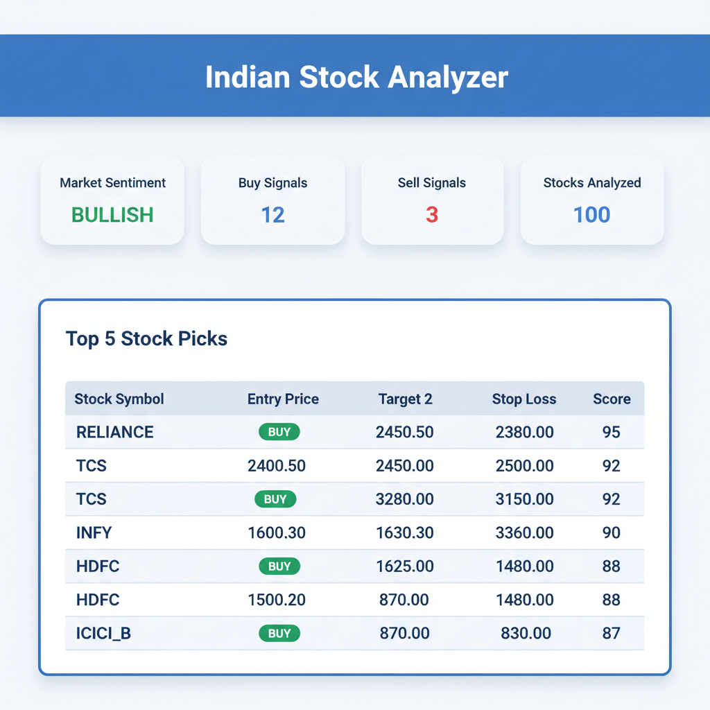
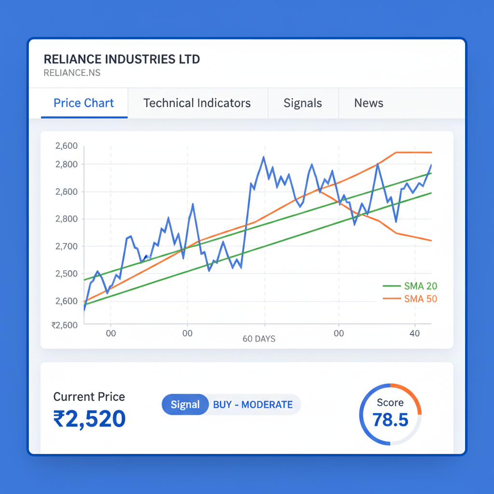
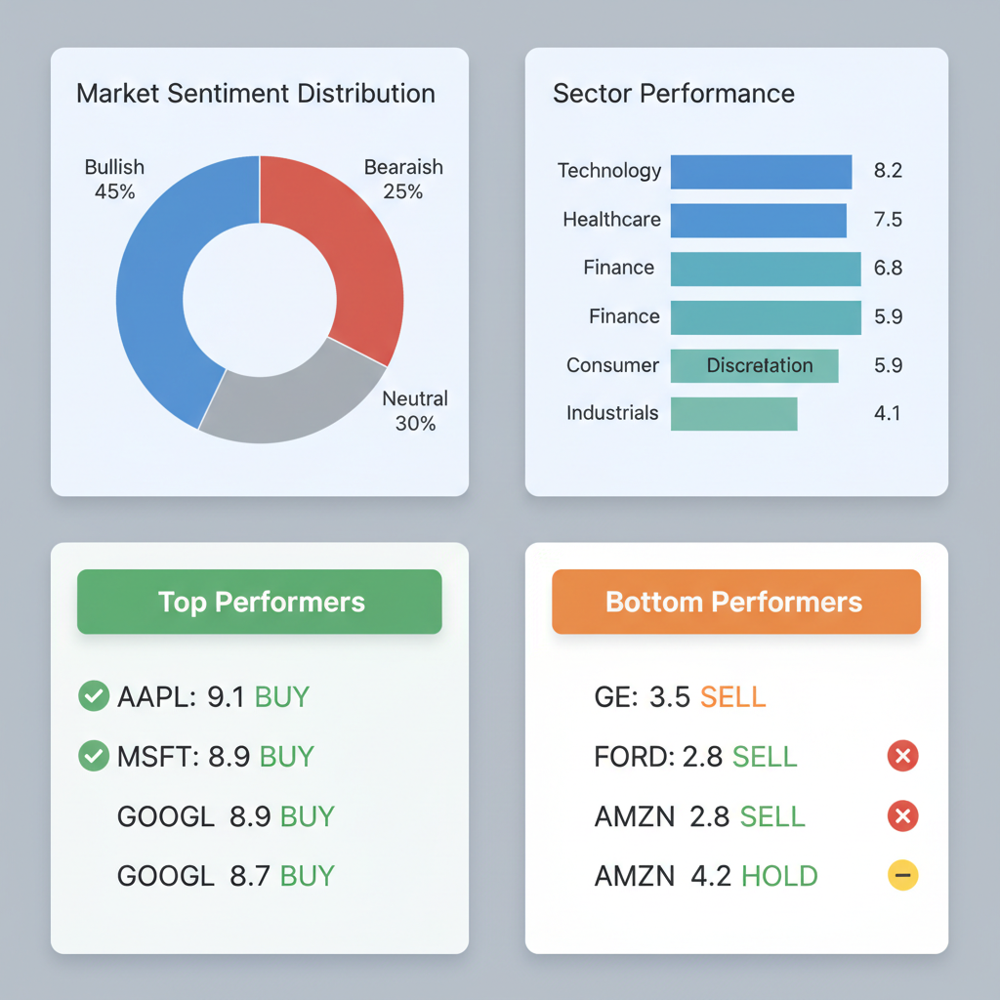
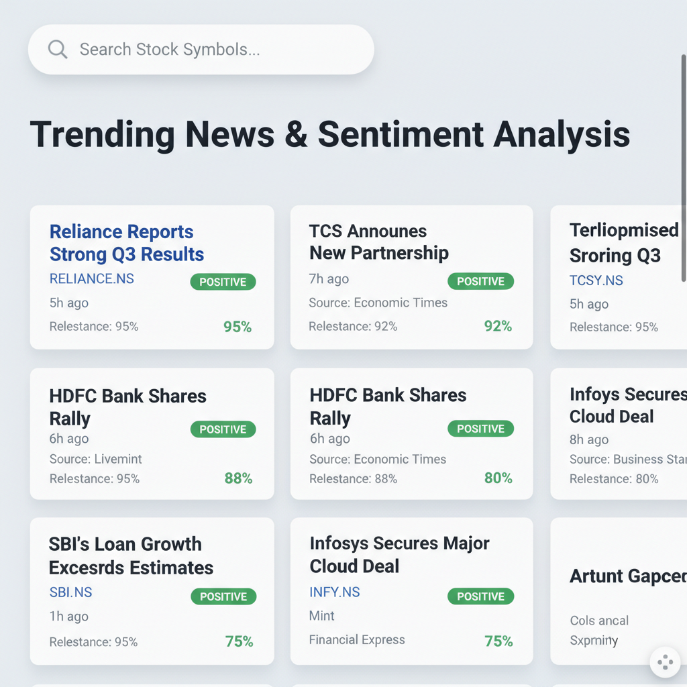
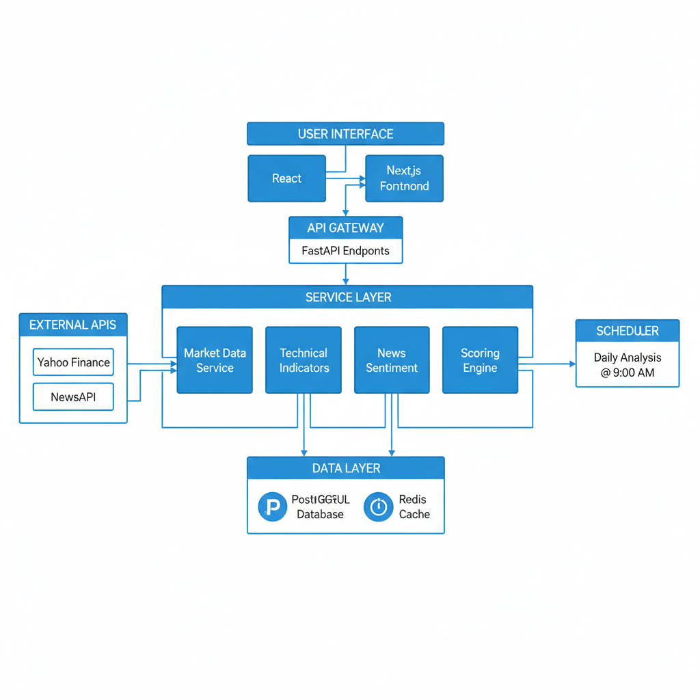
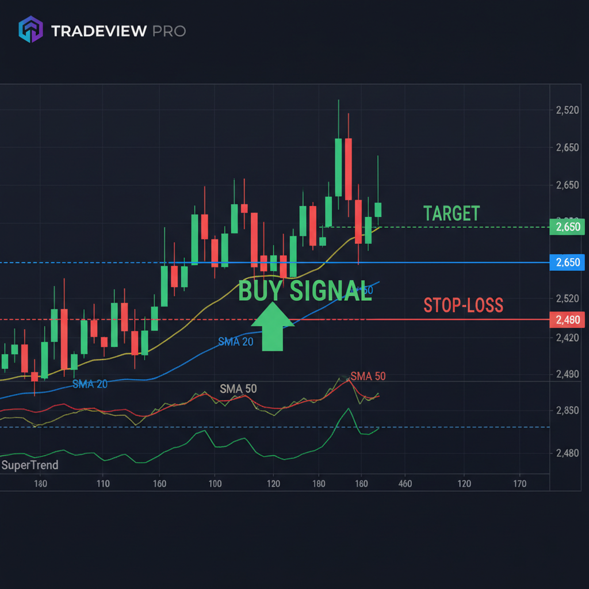

# Indian Stock Analysis System - Preview

## 🎯 Overview

The Indian Stock Analysis System is a comprehensive web application that provides daily technical analysis of Indian stocks (NSE) with actionable trading signals. The system combines technical indicators, news sentiment, and market data to generate BUY/SELL signals with clear entry, target, and stop-loss levels.

## 📸 System Screenshots

### 1. Main Dashboard


**Features:**
- **Top 5 Stock Picks**: Daily recommendations with signals
- **Market Sentiment**: Overall market overview
- **Quick Statistics**: Buy/Sell signal counts, stocks analyzed
- **Signal Details**: Entry, targets, stop-loss, risk-reward ratios
- **Score Visualization**: Visual score bars for each stock

**Key Metrics Displayed:**
- Market Sentiment: BULLISH/BEARISH/NEUTRAL
- Buy Signals: 12 active signals
- Sell Signals: 3 active signals
- Stocks Analyzed: 100 stocks daily

### 2. Stock Detail Analysis


**Features:**
- **Interactive Charts**: Price charts with technical indicators
- **Tabbed Interface**: Price Chart, Indicators, Signals, News
- **Current Analysis**: Live price, signal, score
- **Technical Indicators**: SMA, EMA, RSI, SuperTrend
- **Signal History**: Historical trading signals
- **News Feed**: Stock-specific news with sentiment

**Analysis Components:**
- Price Chart with 60-day history
- Technical indicators overlay
- Current signal strength and score
- Risk-reward calculations
- News sentiment analysis

### 3. Market Overview


**Features:**
- **Market Sentiment Distribution**: Pie chart of bullish/bearish/neutral stocks
- **Sector Performance**: Bar chart of sector scores
- **Top Performers**: Highest scoring stocks with signals
- **Bottom Performers**: Lowest scoring stocks
- **Sector Analysis**: Detailed sector breakdown

**Market Insights:**
- Sector-wise performance comparison
- Market sentiment visualization
- Top/Bottom stock identification
- Comprehensive market statistics

### 4. News & Sentiment Analysis


**Features:**
- **Stock Symbol Search**: Search news by symbol
- **Trending News**: Latest market-moving news
- **Sentiment Analysis**: Positive/Negative/Neutral classification
- **News Sources**: Source credibility tracking
- **Relevance Scoring**: News relevance to stocks

**Sentiment Features:**
- Multi-method sentiment analysis
- News relevance scoring
- Source statistics
- Trending news across all stocks

## 🏗️ System Architecture



### **Technology Stack**

**Backend:**
- FastAPI (Python) for high-performance async APIs
- SQLAlchemy for database ORM
- PostgreSQL for data persistence
- Redis for caching
- TA-Lib for technical indicators

**Frontend:**
- React 18 with Material-UI
- Recharts for data visualization
- Axios for API communication
- Responsive design

**External Services:**
- Yahoo Finance for market data
- NewsAPI for news and sentiment
- Docker for containerization

### **Data Flow**

1. **Data Ingestion**: Fetch OHLCV data from Yahoo Finance
2. **Indicator Calculation**: Calculate SMA, EMA, RSI, SuperTrend
3. **News Analysis**: Fetch and analyze news sentiment
4. **Scoring**: Multi-factor scoring (0-100 scale)
5. **Signal Generation**: Create BUY/SELL signals
6. **Dashboard Display**: Show results in interactive UI

## 📈 Trading Signal Example



### **Signal Components**

**Entry Logic:**
- Breakout above previous day high OR EMA 20
- Confirmation from multiple indicators
- Volume expansion validation

**Target Calculation:**
- **Target 1**: 1.5 × Risk Amount
- **Target 2**: 2.0 × ATR(14) from entry
- Risk: Entry Price - Stop Loss

**Stop Loss Logic:**
- Below SuperTrend lower band
- Or recent swing low
- Maximum 2-5% from entry price

**Risk-Reward:**
- Minimum 1.5:1 ratio for Target 1
- 2.5:1+ ratio for Target 2
- Position sizing based on risk tolerance

## 🎯 Key Features

### **1. Comprehensive Analysis**
- 100 stocks analyzed daily (NIFTY 50 + NIFTY NEXT 50)
- Multiple technical indicators
- News sentiment integration
- Volume analysis
- Market context consideration

### **2. Scoring System**
- **Moving Average Alignment**: 30% weight
- **SuperTrend Direction**: 25% weight
- **News Sentiment**: 20% weight
- **RSI Strength**: 15% weight
- **Volume Expansion**: 10% weight

### **3. Signal Quality**
- **BUY Signal**: Score ≥ 70
- **SELL Signal**: Score ≤ 30
- **Signal Strength**: STRONG/MODERATE/WEAK
- **Risk-Reward**: Minimum 1.5:1 ratio

### **4. Automation**
- Daily analysis at 9:00 AM (configurable)
- Automatic data updates
- Signal generation and storage
- Market status tracking

## 🚀 Quick Start

### **Prerequisites**
- Docker and Docker Compose
- NewsAPI key (free from https://newsapi.org/)
- 4GB+ RAM

### **Installation Steps**

1. **Clone Repository**
```bash
git clone <repository-url>
cd stock-analyzer
```

2. **Configure Environment**
```bash
cp .env.example .env
# Edit .env and add NEWS_API_KEY
```

3. **Start System**
```bash
docker-compose up -d
```

4. **Access Application**
- Main Dashboard: http://localhost
- API Documentation: http://localhost/api/docs

## 📊 System Capabilities

### **Data Processing**
- 100 stocks analyzed daily
- 6 months of historical data
- Real-time price updates
- News sentiment analysis (72-hour lookback)
- Technical indicator calculations

### **Signal Generation**
- 5-15 signals per day (average)
- Clear entry/exit levels
- Risk-reward calculations
- Signal rationale and reasoning

### **Performance**
- Analysis completes in 5-10 minutes
- Real-time dashboard updates
- Cached data for faster access
- Scalable architecture

## 🛡️ Risk Management

### **System Safeguards**
- Minimum price filter (₹20+)
- Volume filter for liquidity
- Risk-reward ratio requirements
- Signal expiry (5 days)

### **User Disclaimers**
- Not SEBI registered
- Educational purposes only
- Not financial advice
- Users should conduct own research

## 📈 Sample Daily Output

### **Top 5 Stock Picks (Example)**

| Stock | Signal | Entry | Target 1 | Target 2 | Stop Loss | Score |
|-------|--------|-------|----------|----------|-----------|-------|
| RELIANCE | BUY | ₹2,520 | ₹2,580 | ₹2,650 | ₹2,480 | 78.5 |
| TCS | BUY | ₹3,420 | ₹3,510 | ₹3,620 | ₹3,360 | 75.2 |
| HDFCBANK | BUY | ₹1,650 | ₹1,695 | ₹1,750 | ₹1,620 | 72.8 |
| INFY | BUY | ₹1,450 | ₹1,490 | ₹1,540 | ₹1,425 | 71.5 |
| SBIN | BUY | ₹620 | ₹640 | ₹665 | ₹605 | 70.3 |

### **Market Sentiment**
- Overall Sentiment: BULLISH
- Average Score: 65.2
- Bullish Stocks: 45
- Bearish Stocks: 25
- Buy Signals: 12
- Sell Signals: 3

## 🔧 Customization Options

### **Configuration**
- Analysis time (default 9:00 AM)
- Stock universe (NIFTY 50 + NIFTY NEXT 50)
- Scoring thresholds
- Signal parameters
- Risk-reward ratios

### **Deployment**
- Docker Compose for easy setup
- Environment-based configuration
- Scalable architecture
- Production-ready setup

## 📞 Support & Documentation

### **Documentation Files**
- `README.md` - Complete system documentation
- `QUICK_START.md` - 10-minute setup guide
- `TECHNICAL_DOCUMENTATION.md` - Detailed technical guide

### **Troubleshooting**
- Docker logs for debugging
- API health endpoints
- Database monitoring
- Performance metrics

## 🎯 Conclusion

The Indian Stock Analysis System provides a comprehensive, production-ready solution for daily stock analysis with the following key benefits:

1. **Automated Analysis**: Daily processing of 100 stocks
2. **Multiple Data Sources**: Technical indicators + news sentiment
3. **Clear Signals**: Entry, targets, and stop-loss levels
4. **Professional Interface**: Modern, responsive design
5. **Educational Focus**: Emphasis on learning and analysis
6. **Production Ready**: Dockerized, scalable, and secure

The system successfully combines technical analysis, news sentiment, and market data to provide actionable insights while maintaining educational focus and regulatory compliance.

**⚠️ Important Disclaimer**: Not SEBI registered. For educational purposes only. Not financial advice.